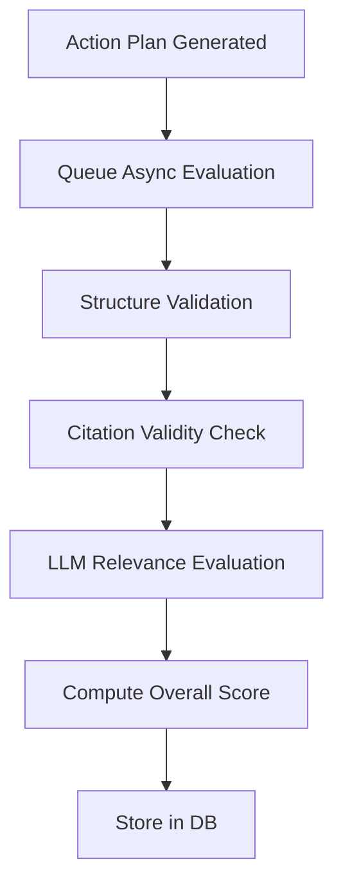

# LLM Evaluation Metrics Documentation

> **Last Updated**: January 2026  
> **Purpose**: Document all LLM evaluation metrics and quality tracking systems

---

## Table of Contents
- [1. Action Plan Evaluation Metrics](#1-action-plan-evaluation-metrics)
- [2. Database Schema](#2-database-schema)
- [3. Evaluation Service](#3-evaluation-service)
- [4. Chat Experience Metrics (Roadmap)](#4-chat-experience-metrics-roadmap)

---

## 1. Action Plan Evaluation Metrics

### Overview

Every generated action plan is evaluated for quality using a combination of **automated checks** and **LLM-based evaluation**.

### Metrics Summary

| Metric | Type | Range | Calculated By | Purpose |
|--------|------|-------|---------------|---------|
| `structure_valid` | Boolean | true/false | Pydantic | Output structure validation |
| `personalization_score` | Integer | 0-100 | GPT-4o-mini | User context alignment |
| `condition_appropriateness` | Integer | 0-100 | GPT-4o-mini | Safety for conditions |
| `feedback_alignment_score` | Integer | 0-100 | GPT-4o-mini | Respect for prior feedback |
| `preference_compliance_score` | Integer | 0-100 | GPT-4o-mini | Diet/allergy adherence |
| `citation_validity_score` | Integer | 0-100 | Auto (regex) | Valid PMID format |
| `citation_relevance_score` | Integer | 0-100 | GPT-4o-mini | Citation supports recommendation |
| `overall_quality_score` | Integer | 0-100 | Weighted avg | Composite score |

### Metric Definitions

#### `structure_valid`
- **What it measures**: Whether the LLM output successfully parsed into the Pydantic schema
- **Calculation**: Automatic - passes if no `ValidationError`
- **Pass criteria**: `true`

#### `personalization_score`
- **What it measures**: How well actions address user's specific conditions, symptoms, and concerns
- **Evaluation prompt**: _"Rate 0-100 how personalized these actions are to the user's diagnosed conditions and health concerns"_
- **Target**: ≥75

#### `condition_appropriateness`
- **What it measures**: Safety of recommendations for user's diagnosed conditions
- **Example**: Not recommending high-intensity exercise for someone with adrenal fatigue
- **Target**: ≥90 (safety critical)

#### `feedback_alignment_score`
- **What it measures**: Whether plan respects user's historical likes/dislikes
- **Example**: Not recommending yoga if user previously disliked it
- **Target**: ≥70

#### `preference_compliance_score`
- **What it measures**: Adherence to dietary restrictions and preferences
- **Example**: No meat for vegetarians, no dairy for lactose intolerant
- **Target**: ≥95 (user experience critical)

#### `citation_validity_score`
- **What it measures**: Format validity of PubMed IDs
- **Calculation**: Regex check for valid PMID format
- **Target**: ≥80

#### `citation_relevance_score`
- **What it measures**: Whether cited research actually supports the recommendation
- **Evaluation prompt**: _"Rate 0-100 how relevant the cited research is to the specific action and hormone target"_
- **Target**: ≥70

---

## 2. Database Schema

### Table: `action_plan_evaluations`

**Location**: [app/core/database.py#L952-L1003](file:///Users/mohanganesh/AUVRA/AuvraJuly15/app/core/database.py#L952-L1003)

```python
class ActionPlanEvaluation(Base):
    __tablename__ = "action_plan_evaluations"
    
    id = Column(Integer, primary_key=True, index=True)
    plan_id = Column(Integer, ForeignKey("action_plans.id"), unique=True)
    uid = Column(String(255), nullable=False, index=True)
    
    # Structural Metrics
    structure_valid = Column(Boolean, default=True)
    
    # Relevance Metrics (0-100, LLM-evaluated)
    personalization_score = Column(Integer, nullable=True)
    condition_appropriateness = Column(Integer, nullable=True)
    feedback_alignment_score = Column(Integer, nullable=True)
    preference_compliance_score = Column(Integer, nullable=True)
    
    # Citation Quality (0-100)
    citation_validity_score = Column(Integer, nullable=True)
    citation_relevance_score = Column(Integer, nullable=True)
    
    # Aggregate
    overall_quality_score = Column(Integer, nullable=True)
    
    # Metadata
    evaluation_cost = Column(String(50), nullable=True)
    evaluation_time_ms = Column(Integer, nullable=True)
    evaluator_model = Column(String(50), default="gpt-4o-mini")
    llm_evaluation_response = Column(JSONB, nullable=True)
    
    created_at = Column(DateTime, default=datetime.utcnow)
```

### Indexes
- `idx_evaluation_plan` on `plan_id`
- `idx_evaluation_user` on `(uid, created_at)`
- `idx_evaluation_score` on `overall_quality_score`

---

## 3. Evaluation Service

### File Location
[app/services/evaluation_service.py](file:///Users/mohanganesh/AUVRA/AuvraJuly15/app/services/evaluation_service.py)

### Configuration

```python
class ActionPlanEvaluator:
    GPT_MODEL = "gpt-5-nano"
    GPT_TEMPERATURE = 0.1  # Low temp for consistent evaluation
```

### Evaluation Flow



### Key Method: `evaluate_plan`

```python
async def evaluate_plan(
    self,
    plan_id: int,
    user_id: Optional[str],
    actions: List[Dict[str, Any]],
    user_context: Dict[str, Any],
    structure_valid: bool,
    db: AsyncSession,
    session_id: Optional[str] = None,
)
```

### LLM Evaluation Prompt
The evaluation prompt asks GPT-4o-mini to rate each metric from 0-100 with justification.

---

## 4. Chat Experience Metrics (Roadmap)

> [!NOTE]
> **These metrics are NOT yet implemented.** This section documents proposed metrics for future implementation.

### Proposed Metrics

| Metric | Type | Description | Implementation |
|--------|------|-------------|----------------|
| `repetition_rate` | Float | How often user repeats questions | NLP similarity check |
| `sentiment_gradient` | Float | Sentiment change first→last msg | Sentiment analysis |
| `conversation_depth` | Integer | Meaningful exchange count | Turn counter with quality filter |
| `response_coherence` | Float | Topic consistency score | Embedding similarity |
| `user_engagement` | Float | Time between messages, message length | Time/length analysis |
| `goal_completion` | Boolean | Did user achieve their intent | Intent matching |

### Proposed Table: `chat_evaluations`

```python
class ChatEvaluation(Base):
    __tablename__ = "chat_evaluations"
    
    id = Column(Integer, primary_key=True)
    session_id = Column(String(36), index=True)
    uid = Column(String(255), index=True)
    
    # Core metrics
    repetition_rate = Column(Float, nullable=True)
    sentiment_gradient = Column(Float, nullable=True)
    conversation_depth = Column(Integer, nullable=True)
    response_coherence = Column(Float, nullable=True)
    
    # Engagement
    avg_response_time_ms = Column(Integer, nullable=True)
    total_messages = Column(Integer, nullable=True)
    user_messages = Column(Integer, nullable=True)
    
    # Outcome
    goal_completed = Column(Boolean, nullable=True)
    
    created_at = Column(DateTime, default=datetime.utcnow)
```

### Implementation Priority
1. **High**: Repetition rate (indicates confusion)
2. **High**: Sentiment gradient (indicates satisfaction)
3. **Medium**: Conversation depth (quality indicator)
4. **Low**: Response coherence (requires embedding model)

---

## Appendix: Quality Thresholds

### Recommended Alert Thresholds

| Metric | Warning | Critical |
|--------|---------|----------|
| `overall_quality_score` | < 70 | < 50 |
| `condition_appropriateness` | < 85 | < 70 |
| `preference_compliance_score` | < 90 | < 80 |
| `personalization_score` | < 60 | < 40 |

### Monitoring Queries

**Average quality by day:**
```sql
SELECT DATE(created_at), AVG(overall_quality_score) 
FROM action_plan_evaluations 
GROUP BY DATE(created_at) 
ORDER BY DATE(created_at) DESC;
```

**Low quality plans:**
```sql
SELECT plan_id, uid, overall_quality_score, created_at
FROM action_plan_evaluations
WHERE overall_quality_score < 50
ORDER BY created_at DESC
LIMIT 20;
```
